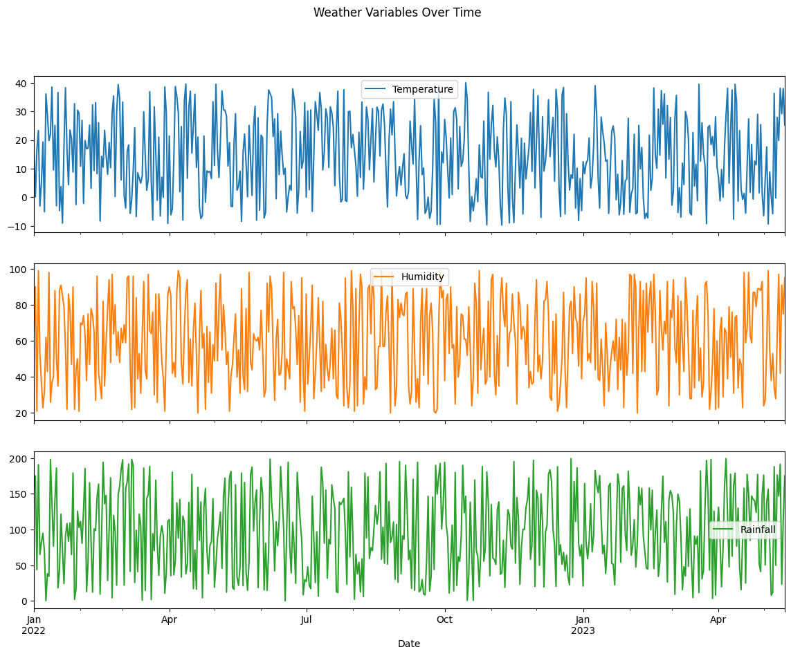
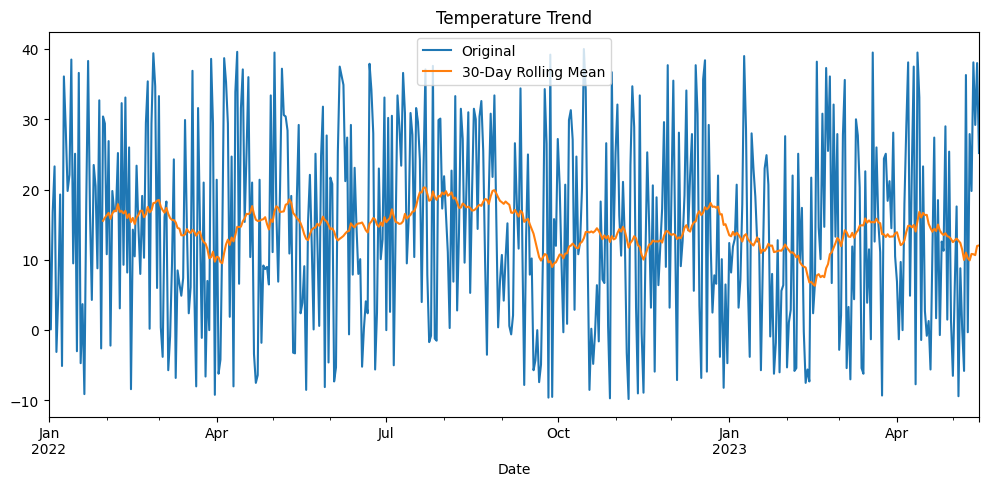
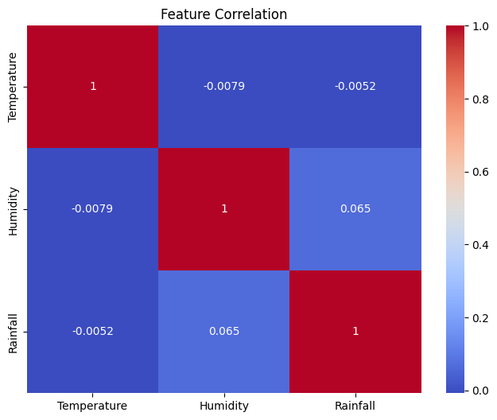
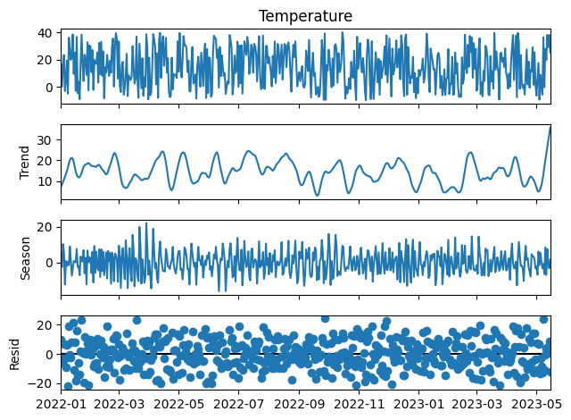
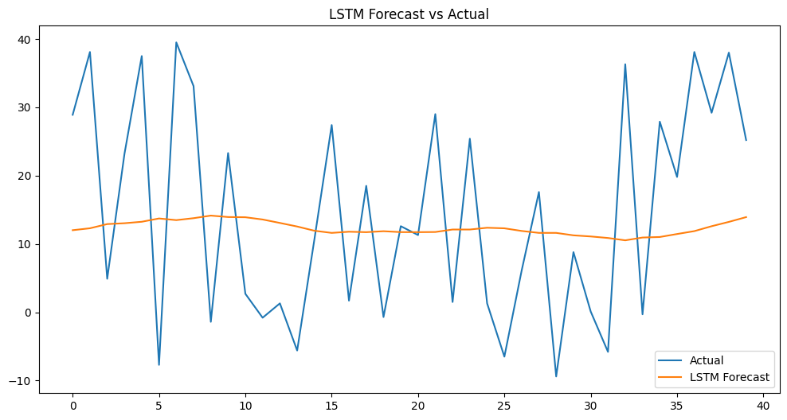

#  Weather Temperature Forecasting using Time Series Analysis and Deep Learning

## Overview

This project presents an end-to-end weather forecasting pipeline for predicting future temperature values using both classical statistical methods and deep learning models. The study compares ARIMA, Holt-Winters Exponential Smoothing, Univariate LSTM, and Multivariate LSTM models to evaluate their forecasting performance on historical weather data.

The project includes exploratory data analysis, stationarity testing, time-series decomposition, feature engineering, model development, and comparative evaluation using standard forecasting metrics.

---

### Performance Metrics

| Model             | MAE    | RMSE   |
| ----------------- | ------ | ------ |
| ARIMA             | 12.687 | 14.536 |
| Holt-Winters      | 12.687 | 14.536 |
| LSTM              | 13.878 | 15.598 |
| Multivariate LSTM | 12.707 | 14.643 |

### Key Insight

Classical statistical forecasting methods outperformed deep learning models on this dataset, demonstrating that simpler models can often achieve superior results when data complexity and volume are limited.

---

# Problem Statement

Accurate temperature forecasting is critical for:

* Weather monitoring
* Agriculture planning
* Energy demand forecasting
* Environmental analysis
* Climate research

The objective of this project is to compare traditional time-series forecasting techniques with deep learning approaches and determine which methodology provides the most accurate predictions.

---

# Dataset

The dataset consists of historical weather observations containing:

| Feature     | Description                 |
| ----------- | --------------------------- |
| Date        | Observation timestamp       |
| Temperature | Daily temperature values    |
| Humidity    | Daily humidity percentage   |
| Rainfall    | Daily rainfall measurements |

The data spans multiple seasonal cycles, making it suitable for trend and seasonality analysis.

---

# Project Workflow

```text
Data Collection
        ↓
Data Cleaning & Preprocessing
        ↓
Exploratory Data Analysis
        ↓
Stationarity Testing (ADF)
        ↓
Time Series Decomposition (STL)
        ↓
Feature Engineering
        ↓
Model Development
        ├── ARIMA
        ├── Holt-Winters
        ├── LSTM
        └── Multivariate LSTM
        ↓
Model Evaluation
        ↓
Performance Comparison
```

---

# Data Preprocessing

The following preprocessing steps were performed:

* Converted date column to datetime format
* Set date column as time-series index
* Removed duplicate timestamps
* Checked and handled missing values
* Applied Min-Max scaling
* Generated train-test split
* Created sequential datasets for LSTM training

---

# Exploratory Data Analysis

## Weather Variables Over Time

The visualization below shows the temporal behavior of temperature, humidity, and rainfall throughout the observation period.



---

## Temperature Trend Analysis

A 30-day rolling mean was used to smooth short-term fluctuations and reveal long-term temperature trends.



---

## Correlation Analysis

Correlation analysis was performed to understand relationships between weather variables.



### Observations

* Temperature and humidity exhibit very weak correlation.
* Temperature and rainfall are nearly independent.
* Humidity and rainfall show a slight positive relationship.

---

# Time Series Analysis

## Stationarity Testing

The Augmented Dickey-Fuller (ADF) test was applied to determine whether the temperature series is stationary.

This step is essential before fitting ARIMA models.

---

## STL Decomposition

Seasonal-Trend Decomposition using Loess (STL) was performed to separate the series into:

* Trend Component
* Seasonal Component
* Residual Component



This decomposition provides valuable insights into the underlying structure of the temperature series.

---

# Models Implemented

## 1. ARIMA

AutoRegressive Integrated Moving Average (ARIMA) was implemented as a baseline statistical forecasting model.

### Advantages

* Captures autoregressive dependencies
* Suitable for stationary series
* Highly interpretable

---

## 2. Holt-Winters Exponential Smoothing

A classical forecasting technique capable of modeling:

* Level
* Trend
* Seasonality

### Advantages

* Computationally efficient
* Strong benchmark for forecasting tasks
* Handles seasonal patterns effectively

---

## 3. Univariate LSTM

A Long Short-Term Memory (LSTM) neural network was trained using historical temperature observations.

### Architecture

* LSTM Layer
* Dropout Layer
* Dense Output Layer
* Early Stopping Regularization

### Input Features

* Temperature

---

## 4. Multivariate LSTM

An enhanced LSTM model utilizing multiple weather variables.

### Input Features

* Temperature
* Humidity
* Rainfall
* Seasonal cyclical features

### Benefits

* Captures interactions among weather variables
* Learns complex nonlinear relationships
* Provides richer contextual information

---

# Forecasting Results

## LSTM Forecast vs Actual

The figure below compares actual temperature observations against LSTM forecasts.



### Observation

The LSTM model captures the overall trend but struggles to accurately predict large fluctuations in temperature.

---

# Results Summary

| Model             | MAE    | RMSE   |
| ----------------- | ------ | ------ |
| ARIMA             | 12.687 | 14.536 |
| Holt-Winters      | 12.687 | 14.536 |
| LSTM              | 13.878 | 15.598 |
| Multivariate LSTM | 12.707 | 14.643 |

---

# Key Findings

### Statistical Models Outperformed Deep Learning

ARIMA and Holt-Winters achieved the lowest forecasting error on this dataset.

### Additional Weather Features Improved LSTM Performance

The Multivariate LSTM performed significantly better than the Univariate LSTM, indicating that humidity and rainfall provide useful predictive information.

### Model Complexity Does Not Guarantee Better Performance

The results highlight an important machine learning principle:

> Strong statistical baselines should always be evaluated before adopting more complex deep learning architectures.

---

# Technologies Used

### Programming Language

* Python

### Data Analysis

* Pandas
* NumPy

### Visualization

* Matplotlib
* Seaborn

### Statistical Forecasting

* Statsmodels
* ARIMA
* Holt-Winters

### Deep Learning

* TensorFlow
* Keras

### Model Evaluation

* Scikit-Learn

---

# Repository Structure

```text
weather-forecasting-time-series/
│
├── weather_forecasting_time_series_analysis.ipynb
├── README.md
├── requirements.txt
├── architecture.png
│
├── images/
│   ├── model_comparison.png
│   ├── weather_variables.png
│   ├── temperature_trend.png
│   ├── correlation_heatmap.png
│   ├── stl_decomposition.png
│   └── lstm_actual_v_forecasts.png

```

---

# Future Improvements

* Hyperparameter optimization using Optuna
* GRU-based forecasting models
* Transformer-based time-series forecasting
* Walk-forward validation
* Probabilistic forecasting
* Streamlit deployment
* Real-time weather prediction pipeline

---

# Conclusion

This project demonstrates a complete time-series forecasting workflow using both statistical and deep learning approaches. Through extensive experimentation and comparative evaluation, ARIMA and Holt-Winters emerged as the best-performing models, outperforming LSTM-based architectures on the given dataset.

The findings reinforce the importance of benchmarking advanced machine learning models against strong statistical baselines before selecting a production-ready forecasting solution.


# Author
Siddharth Jain
